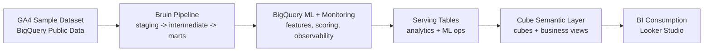

# DE-PROJECT: GA4 Ecommerce Analytics Pipeline

DE-PROJECT is an end-to-end analytics project that turns the public GA4 ecommerce sample dataset into trusted analytical tables, BigQuery ML outputs, and a governed Cube semantic layer for BI consumption.

The project is designed to show a complete warehouse-native analytics flow:

- source data in BigQuery Public Data
- ELT orchestration with Bruin
- model training and scoring in BigQuery ML
- observability and Responsible AI tables in BigQuery
- semantic modeling in Cube
- dashboard consumption through Looker Studio

## System Flow



## Repository Layout

| Path | Purpose |
|------|---------|
| `assets/` | Bruin SQL assets for staging, marts, ML, and observability |
| `pipeline.yml` | Bruin pipeline definition with `dev` and `prod` environments |
| `cube-semantic/model/` | Cube cubes and business-facing views |
| `docs/` | Product-facing setup, usage, architecture, and lineage docs |
| `.github/workflows/` | CI validation and scheduled production run workflows |

## What This Repo Includes

- BigQuery-backed Bruin assets for staging, intermediate, marts, ML, and monitoring layers
- Cube semantic models for executive KPIs, funnel analysis, customer segmentation, predictive LTV, and model monitoring
- documentation for setup, configuration, usage, architecture, and lineage
- GitHub Actions workflows for CI validation and scheduled pipeline execution

## Quick Start

### 1. Install prerequisites

You will need:

- Bruin CLI
- Python 3.13 or later for any optional local validation helpers you choose to add
- Node.js 20 if you want to validate or run the Cube semantic layer locally
- a Google Cloud service account with BigQuery access to the target datasets

### 2. Configure credentials

Create a local `.env.local` from `.env.local.example` and set:

- `GCP_SERVICE_ACCOUNT_KEY`

Load that value into your active shell before running Bruin commands. Keep
credentials out of Git. The checked-in example file is only a template.

### 3. Validate the pipeline

Bruin validation in this project expects credentials to be configured first,
because the public mirror keeps the real BigQuery connection shape.

```powershell
bruin validate .
```

### 4. Run the pipeline

```powershell
bruin run --environment dev .
```

Use `prod` when you want to target the production dataset.

## Key Docs

- [Setup](docs/setup.md)
- [Configuration](docs/configuration.md)
- [Usage](docs/usage.md)
- [Pipeline](docs/pipeline.md)
- [Architecture](docs/architecture.md)
- [Lineage](docs/lineage.md)
- [Source Dataset Notes](docs/bigquery-public-data.ga4_obfuscated_sample_ecommerce%20Dataset.md)

## Tech Stack

```text
GA4 (BigQuery Public Data)
  -> Bruin
  -> BigQuery
  -> BigQuery ML
  -> Cube
  -> Looker Studio
```

- storage and compute: BigQuery
- orchestration and ELT: Bruin
- ML: BigQuery ML
- semantic layer: Cube
- BI: Looker Studio
- automation: GitHub Actions
