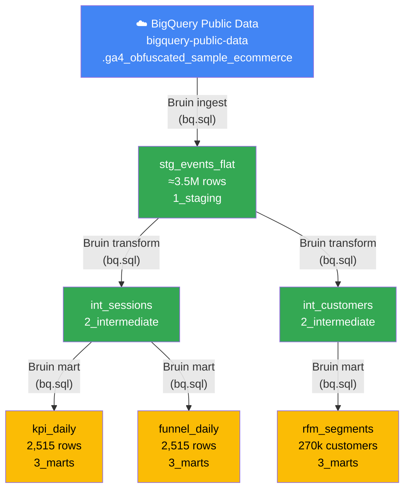
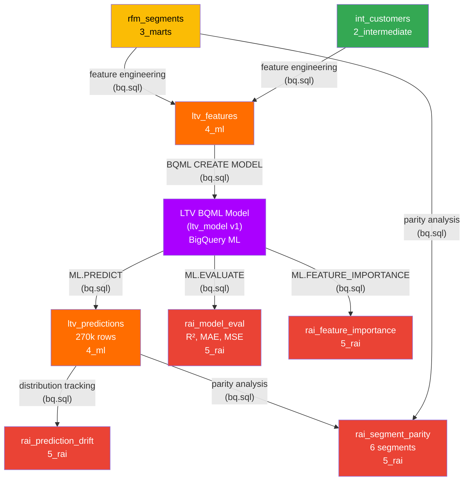
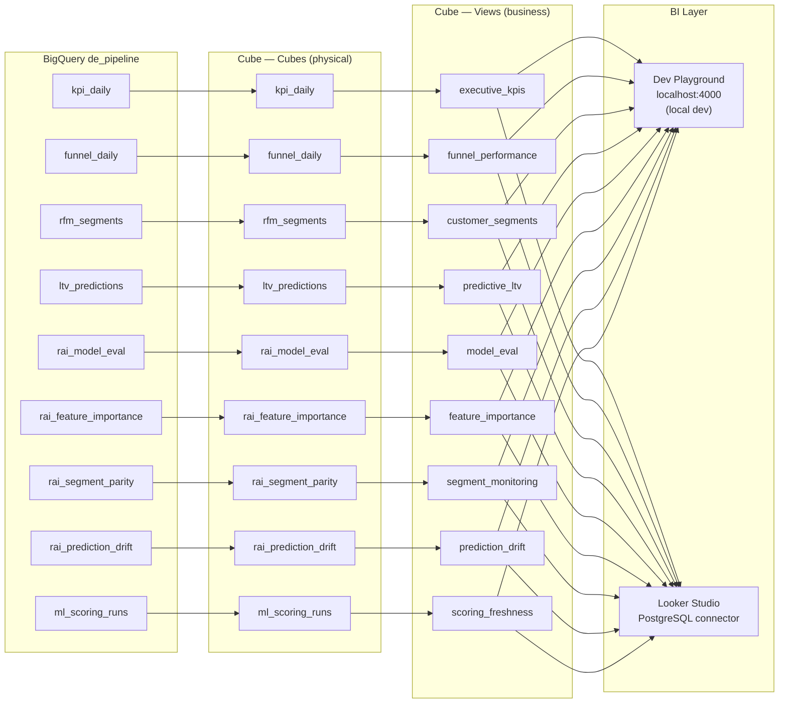
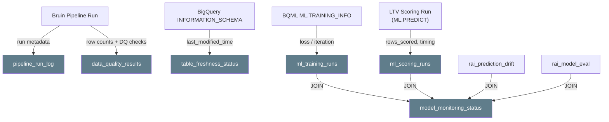

# Pipeline Lineage

End-to-end data lineage for the ecommerce analytics pipeline.

The diagrams below show the logical lineage across data preparation, ML, semantic modeling, and observability.

---

## 1. Data Lineage — Source → Marts

---

## 2. ML Lineage — Marts → Features → Model → Predictions → RAI

---

## 3. Semantic Lineage — BigQuery Tables → Cube → BI

---

## 4. Observability Lineage — Pipeline → Monitoring Tables

